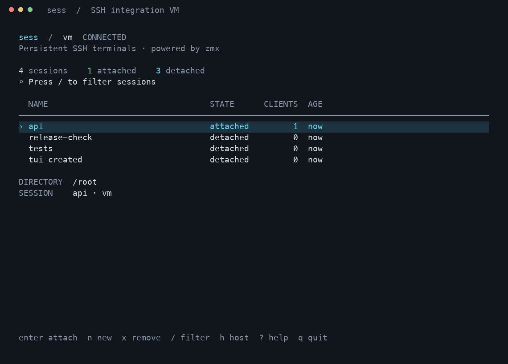

# sess

**A persistent SSH terminal. Powered by zmx.**

[Download v0.6.0](https://github.com/DeepakSilaych/sess/releases/tag/v0.6.0) · [User guide](docs/user-guide.md) · [Website](https://deepaksilaych.github.io/sess/) · [Changelog](CHANGELOG.md)

Give a terminal on your VM a name. Leave it running. Come back to the same shell, directory, and programs after you detach or lose your connection.

```sh
sess init user@host
sess set --host user@host
sess new work
# Ctrl+\ to detach
sess attach work
```

Run `sess` to browse your sessions. Your terminal application handles tabs and windows; sess handles session management and reconnection.

## Install

Download the archive for your laptop from [v0.6.0](https://github.com/DeepakSilaych/sess/releases/tag/v0.6.0):

| Platform | Archive |
| --- | --- |
| macOS, Apple Silicon | [sess-darwin-arm64.tar.gz](https://github.com/DeepakSilaych/sess/releases/download/v0.6.0/sess-darwin-arm64.tar.gz) |
| macOS, Intel | [sess-darwin-amd64.tar.gz](https://github.com/DeepakSilaych/sess/releases/download/v0.6.0/sess-darwin-amd64.tar.gz) |
| Linux, ARM64 | [sess-linux-arm64.tar.gz](https://github.com/DeepakSilaych/sess/releases/download/v0.6.0/sess-linux-arm64.tar.gz) |
| Linux, AMD64 | [sess-linux-amd64.tar.gz](https://github.com/DeepakSilaych/sess/releases/download/v0.6.0/sess-linux-amd64.tar.gz) |

For example, on an Apple Silicon Mac, after downloading the archive:

```sh
tar -xzf sess-darwin-arm64.tar.gz
mkdir -p ~/.local/bin
install -m 755 sess ~/.local/bin/sess
export PATH="$HOME/.local/bin:$PATH"
sess version
```

Add the PATH line to your shell configuration if needed for future terminals. Use the corresponding archive name on another platform. [SHA256SUMS](https://github.com/DeepakSilaych/sess/releases/download/v0.6.0/SHA256SUMS) accompanies the release. Each archive includes the user documentation and all four remote helpers.

The client needs OpenSSH. The VM needs working SSH access; `sess init` installs its helper and zmx. A compiler is only needed when building from source.

### Build from source

Requires Go 1.26.5+ to build. The installed client needs OpenSSH. Linux and macOS on AMD64 and ARM64 are supported build targets.

```sh
git clone https://github.com/DeepakSilaych/sess.git
cd sess
make build
./dist/sess --help
make install                       # default: ~/.local/bin
# or: make install PREFIX=/usr/local
```

Ensure the installation's `bin` directory is in your PATH. `make build` embeds the remote helpers for all four targets, so the remote VM needs neither Go nor a compiler. `go install` alone does not generate those helpers; use `make build` or a release archive.

Version 0.6.0 uses zmx. Existing tmux sessions from 0.5 continue to belong to tmux; they cannot be converted into live zmx sessions. Attach to them with tmux while finishing that work. The old `~/.sess` state is left untouched.

## Prepare a host

```sh
sess init dev                        # existing SSH alias, or user@host
sess set --host dev                  # choose the default separately
sess doctor
```

`init` verifies SSH, detects the VM's platform, installs the remote helper and pinned zmx 0.8.1 under `~/.local/share/sess/bin`, and checks the result. No sudo, extra network port, or laptop daemon. The zmx archive is downloaded over HTTPS and verified against its pinned SHA-256 digest before installation. A different existing managed zmx version is not silently replaced.

Use SSH keys available to `ssh-agent` for session operations and reconnecting. Provisioning can prompt through SSH; subsequent operations use OpenSSH's batch mode so a background refresh cannot ask for a password. Configure ports, jump hosts, and identities in `~/.ssh/config`.

`init` does not change your default host. It also does not edit your shell startup files.

## Commands

| Command | Shortcut | Purpose |
| --- | --- | --- |
| `sess init <host>` | | Prepare the VM |
| `sess set --host <host>` | `sess set -h <host>` | Save the default SSH destination |
| `sess new <name>` | `sess n <name>` | Create and attach |
| `sess attach <name>` | `sess a <name>` | Attach to an existing session |
| `sess remove <name>` | `sess rm <name>` | End the session and its programs |
| `sess ls` | | List live sessions |
| `sess detach` | | Inside a session, detach all attached terminals |
| `sess` | | Open the interactive session browser |
| `sess doctor` | | Check SSH and remote dependencies |
| `sess version` | | Print version |
| `sess completion bash` | | Generate bash, zsh, or fish completion |

Use `--host` or `-h` to override the host for a session command without changing the default:

```sh
sess n build -h staging
sess a build -h staging
sess ls -h staging
sess rm build -h staging
```

Host resolution is explicit flag → saved default → actionable error. There is no local fallback. `-h` means host; help is `--help`.

Names are 1–48 letters, numbers, hyphens, or underscores, starting with a letter or number. Names are scoped to the remote account. Aliases for the same account and VM see the same sessions.

New shells start in the remote home directory. Use `cd` normally. Sessions share the VM's filesystem and Git checkout; creating a session does not copy a repository.

### Scripts

```sh
sess new build --detach             # also: -d; does not need a terminal
sess ls --json                      # {"host": "dev", "sessions": [...]}
sess ls --quiet                     # names only; also: -q
```

Redirected bare `sess` prints a list. `new` without `--detach` and `attach` require an interactive terminal. Errors go to stderr with a nonzero exit status. JSON list output includes stable session IDs, client counts, creation time, backend-reported directory, PID, and attached/detached state.

## Detach and reconnect

- **Ctrl+\** detaches only your current terminal. Work stays on the VM.
- **Close the terminal tab** to disconnect; attach from another terminal later.
- **`sess detach` inside the remote shell** detaches every client of that session.
- **Ctrl+C while attached** interrupts the foreground program as usual.
- **`exit` at the main shell prompt** ends the session.
- **`sess rm <name>`** terminates the session; files written to the VM remain.

When SSH reports a transient connection failure, sess retries with delays of 1, 2, 4, 8, then at most 15 seconds. Ctrl+C during reconnection cancels the attempt. Intentional detach and normal shell exit do not reconnect. Authentication, host-key, configuration, and unknown SSH errors are reported instead of blindly retried.

A reconnect request carries the original session ID. If somebody removed the session and reused its name, reconnect stops instead of knowingly attaching you to the replacement. Missing sessions are never recreated by the sess attach command.

No reconnect process remains after you close the client terminal. Run `sess a <name>` to return. The VM and zmx must stay alive: live sessions do not survive a VM reboot, backend crash, or operating-system process cleanup.

## Session browser



*Captured from the real SSH integration test. Names shown are test sessions.*

The browser refreshes asynchronously, shows host context and client counts, and has distinct loading, empty, filtered, and unreachable-host states.

| Key | Action |
| --- | --- |
| `↑` / `↓`, `k` / `j` | Select a session |
| `Enter` | Attach; return to the browser on detach |
| `n` | Create and attach |
| `x` | Remove; type the session name to confirm in the browser |
| `/` | Filter by name |
| `h` | Browse another host without changing your saved default |
| `r` | Refresh |
| `?` | Keyboard help |
| `q`, `Esc` | Quit or cancel the current form |

The terminal is handed directly to SSH while attached; sess does not wrap the shell in another TUI. `NO_COLOR` is supported. Start attachments from an ordinary laptop terminal, rather than nesting persistent terminals across SSH.

## Under the hood

```text
laptop                          VM
sess CLI / browser ── SSH ──> sess agent
                                │
                            zmx client
                                │ Unix socket
                            zmx daemon
                                │ PTY
                            shell + programs
```

The agent speaks a versioned JSON command protocol over ordinary SSH. Requests are encoded as a single argument; names and hosts are validated rather than interpolated into shell commands. Interactive attachment uses SSH's PTY. The client never reimplements SSH authentication or terminal emulation.

zmx owns the terminal process and restores its display when a client returns. sess uses a private, account-specific runtime directory, separate from ordinary zmx sessions. A random ID is stored on each session; zmx supplies live session state, so a local cache cannot claim that an unreachable VM is empty.

The remote agent is installed at an absolute path relative to `$HOME`; SSH startup PATH is not required. Session shells receive the managed binary directory on PATH so `sess detach` works there. User shell configuration can still override PATH. The displayed directory comes from zmx. It starts at the creation directory and can update when the shell reports directory changes using OSC 7. Run `pwd` in the shell for its current directory.

Local configuration is `~/.config/sess/config.json` (`XDG_CONFIG_HOME` supported), written atomically with private permissions. `SESS_CONFIG` overrides its path. Runtime and backend overrides `SESS_RUNTIME_DIR` and `SESS_ZMX` are intended for development/testing. `SESS_SSH` selects a local SSH executable or wrapper.

## Development

```sh
make build                          # builds client and embeds remote helpers
make test                           # unit tests with race detector + go vet
make integration                    # real SSH and zmx in disposable Docker
```

Integration testing requires Docker, Python 3, and OpenSSH. It generates temporary keys/configuration, binds SSH only on loopback, and removes its test container on exit. It does not operate on your configured VMs.

```text
cmd/sess/                Client entry point
cmd/sess-agent/          Small remote helper entry point
internal/api/            Shared data types and validation
internal/cli/            Commands and completion
internal/tui/            Interactive session browser
internal/transport/      System SSH and reconnect policy
internal/backend/        zmx lifecycle and namespace
internal/agent/          Remote request handling
internal/provision/      Embedded helpers and verified zmx installer
internal/store/          Local configuration
scripts/                 Cross-build and release packaging
test/integration/        Isolated SSH lifecycle tests
```

## More documentation

- [User guide](docs/user-guide.md): setup, commands, detach, reconnect, and persistence.
- [Troubleshooting](docs/troubleshooting.md): authentication, missing sessions, PATH, and backend versions.
- [Contributing](CONTRIBUTING.md): local builds, tests, and project conventions.
- [Release process](docs/releasing.md): manual tagging, archives, and verification.
- [Changelog](CHANGELOG.md): version history and migration notes.

[zmx](https://github.com/neurosnap/zmx) · [MIT license](LICENSE)
